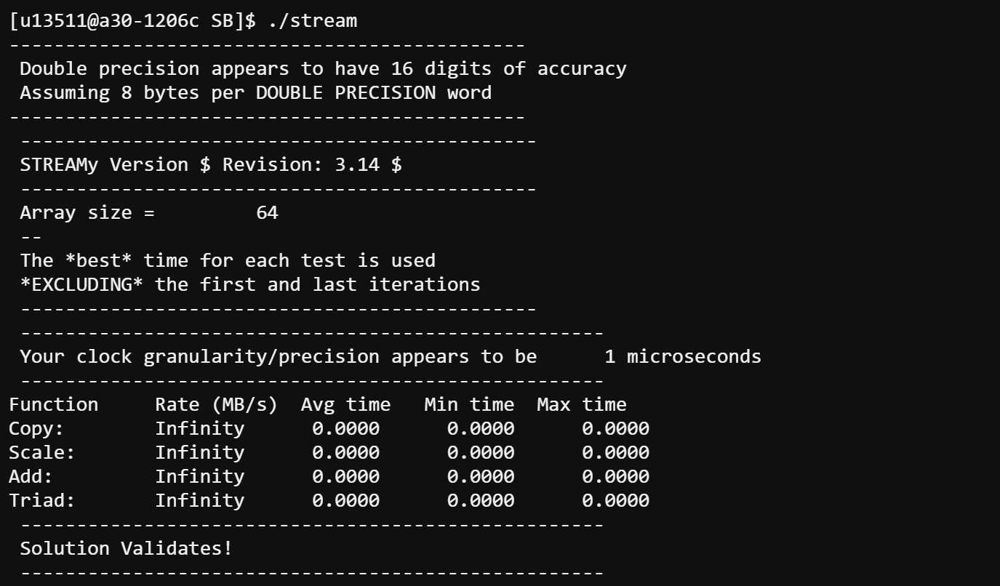
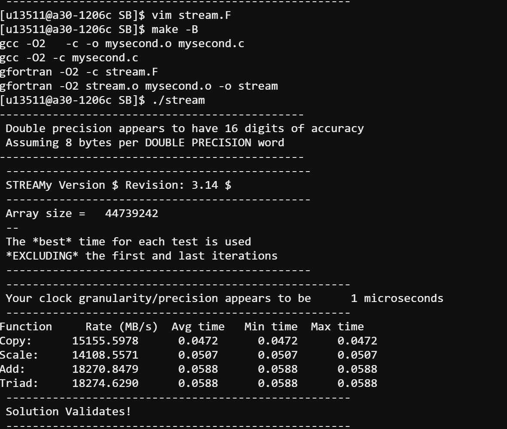

# Recording STREAM Benchmark Results and Calculating Performance

## Guide for Filling the fugaku.data File

This guide explains how to record your STREAM benchmark results and calculate GFLOPs for the roofline plot.

---

## Table of Contents

1. [Understanding STREAM Output](#understanding-stream-output)
2. [Recording Your Results](#recording-your-results)
3. [Calculating GFLOPs](#calculating-gflops)
4. [Filling the fugaku.data File](#filling-the-fugakudata-file)
5. [Common Issues](#common-issues)

---

## Understanding STREAM Output

### Example Output (Problematic - Array Too Small)



*Figure 1: Initial run with default array size of 64 elements showing "Infinity" results*

**Key observations from the screenshot:**
- `Array size = 64` - This is far too small
- All rates show `Infinity` - Division by zero (time too small to measure)
- All times show `0.0000` - Timer cannot capture such fast operations
- `Solution Validates!` - The math is correct, but the measurement is invalid

**Problem:** Array size of 64 is too small. The computation finishes faster than the timer can measure, resulting in "Infinity" (division by zero time).

---

### Example Output (Good - Proper Array Size)



*Figure 2: After fixing array size to 44739242, showing valid benchmark results*

**Key observations from the screenshot:**
- `Array size = 44739242` - Proper size (~1GB total memory)
- `Triad: 18274.6290 MB/s` - This is valid, measurable data
- Times are non-zero (e.g., `0.0588` seconds) - Timer can measure properly
- `Solution Validates!` - Results are mathematically correct

**This is valid data** that can be recorded and used for analysis.

**From this screenshot, we can calculate:**
```
Triad GFLOPs = 18274.6290 / 12000 = 1.52 GFLOPs
```

---

## Recording Your Results

### Key Values to Record

From each STREAM run, record the following for the **Triad** kernel:

| Field | Description | Example Value |
|-------|-------------|---------------|
| Array size | Number of elements per array | 44739242 |
| Rate (MB/s) | Memory bandwidth achieved | 843528.6683 |
| Number of Threads | OpenMP threads used | 48 |

---

## Calculating GFLOPs

### Step 1: Understand the TRIAD Operation

```fortran
Triad: A[i] = B[i] + scalar * C[i]
```

For each array element `i`, the TRIAD performs:
- **1 multiplication:** `scalar * C[i]`
- **1 addition:** `B[i] + result`

**Total: 2 floating-point operations per element**

---

### Step 2: Calculate Total FLOPs per Second

**Formula:**

```
FLOP/s = (Array_Size × FLOPs_per_element) / Min_time
```

Or equivalently, using the Rate:

```
FLOP/s = (Rate_in_MB/s × 1,000,000 × FLOPs_per_element) / Bytes_per_element
```

---

### Step 3: TRIAD Arithmetic Intensity

For TRIAD `A[i] = B[i] + scalar*C[i]`:

| Memory Access | Bytes |
|---------------|-------|
| Read B[i] | 8 bytes |
| Read C[i] | 8 bytes |
| Write A[i] | 8 bytes |
| **Total** | **24 bytes** |

| Computation | FLOPs |
|-------------|-------|
| scalar * C[i] | 1 |
| B[i] + result | 1 |
| **Total** | **2 FLOPs** |

**Arithmetic Intensity (AI) = 2 FLOPs / 24 bytes = 0.0833 FLOP/byte**

---

### Step 4: Calculate GFLOPs from Rate

**Formula:**

```
GFLOPs = Rate_in_MB/s × Arithmetic_Intensity / 1000
```

**Or more directly:**

```
GFLOPs = Rate_in_MB/s × (2/24) / 1000
GFLOPs = Rate_in_MB/s / 12000
```

---

### Calculation Examples

#### Example 1: First Run (Broken - Infinity)

From Figure 1 (InitialRun.png):
```
Array size = 64
Triad Rate = Infinity
```

**Result:** Cannot calculate - array too small, invalid data. **Do not record this in fugaku.data.**

---

#### Example 2: Serial Run with Fixed Array Size

From Figure 2 (Attemp1.png):
```
Array size = 44739242
Triad Rate = 18274.6290 MB/s
```

**Calculation:**

```
GFLOPs = 18274.6290 / 12000
GFLOPs = 1.52 GFLOPs
```

**For fugaku.data:**
- Arithmetic Intensity: 0.0833
- Performance: 1.52 GFLOPs

---

#### Example 3: Optimized Run (~845 GB/s)

```
Array size = 44739242
Triad Rate = 843528.6683 MB/s
```

**Calculation:**

```
GFLOPs = 843528.6683 / 12000
GFLOPs = 70.29 GFLOPs
```

**For fugaku.data:**
- Arithmetic Intensity: 0.0833
- Performance: 70.29 GFLOPs

---

## Filling the fugaku.data File

### File Format

The `fugaku.data` file typically has the format:

```
# Label  ArithmeticIntensity  GFLOPs
Triad0   0.0833               1.18
Triad1   0.0833               5.33
Triad2   0.0833               7.58
Triad3   0.0833               52.58
Triad4   0.0833               70.29
```

---

### Step-by-Step Instructions

#### Step 1: Open the data file

```bash
vim fugaku.data
```

**Explanation:** Open the data file in vim editor to add your benchmark results.

---

#### Step 2: Record each attempt

For each optimization attempt, add a line with:
1. A label (e.g., Triad0, Triad1, ...)
2. The arithmetic intensity (always 0.0833 for TRIAD)
3. The calculated GFLOPs

---

#### Step 3: Calculate GFLOPs from your Rate

Use this formula for each run:

```
GFLOPs = Your_Triad_Rate_MB_per_s / 12000
```

---

### Quick Reference Table

Use this table to convert your Triad Rate to GFLOPs:

| Triad Rate (MB/s) | GFLOPs | % of Peak (1024 GB/s) |
|-------------------|--------|----------------------|
| 14,000 | 1.17 | 1.4% |
| 64,000 | 5.33 | 6.3% |
| 91,000 | 7.58 | 8.9% |
| 631,000 | 52.58 | 62% |
| 739,000 | 61.58 | 72% |
| 845,000 | 70.42 | 82% |

---

### Example fugaku.data File

```
# STREAM Triad Results on Fugaku A64FX
# Format: Label  AI(flop/byte)  Performance(GFLOPs)
#
# Attempt 1: Default array size (64) - INVALID, do not record
# Attempt 2: Array size fixed (44739242), serial run
Triad0   0.0833   1.52
# Attempt 4: OpenMP enabled (48 threads)
Triad1   0.0833   5.33
# Attempt 5: Fujitsu compiler
Triad2   0.0833   7.58
# Attempt 7: First-touch + format fixes
Triad3   0.0833   52.58
# Attempt 9: Prefetch/zfill flags
Triad4   0.0833   61.58
# Attempt 10: Tuned parameters (ZFILL=16, PREF=12)
Triad5   0.0833   70.29
```

---

## Common Issues

### Issue 1: "Infinity" in Rate

**Cause:** Array size too small (computation faster than timer resolution)

**Solution:** Increase array size to at least 44739242 (1GB total)

```bash
vim stream.F
```

**Explanation:** Edit the source file and find the PARAMETER statement for array size. Change it to a larger value.

---

### Issue 2: "**********" in Rate

**Cause:** Print format overflow (number too large for format specifier)

**Solution:** Edit the print format in stream.F

```bash
vim stream.F
```

**Explanation:** Find the FORMAT statement and increase the field width (e.g., F10.4 to F12.4).

---

### Issue 3: Different Array Sizes Between Runs

**Important:** The arithmetic intensity (0.0833) remains constant regardless of array size.

If you used different array sizes:
- The GFLOPs calculation is still: `Rate / 12000`
- The AI is always: `2 FLOPs / 24 bytes = 0.0833`

---

### Issue 4: Rate in Different Units

STREAM reports Rate in **MB/s** (megabytes per second).

To convert:
- MB/s to GB/s: divide by 1000
- MB/s to GFLOPs (for Triad): divide by 12000

---

## Summary Formula Card

### TRIAD Kernel

```
A[i] = B[i] + scalar * C[i]
```

| Metric | Value | Formula |
|--------|-------|---------|
| FLOPs per element | 2 | 1 mul + 1 add |
| Bytes per element | 24 | 3 arrays × 8 bytes |
| Arithmetic Intensity | 0.0833 | 2 / 24 |
| GFLOPs from Rate | Rate/12000 | Rate × AI / 1000 |

### Quick Conversion

```
GFLOPs = Triad_Rate_MB_per_s / 12000
```

---

## Verification

To verify your calculations, check that your GFLOPs value makes sense:

| Performance Level | Expected GFLOPs | Description |
|-------------------|-----------------|-------------|
| ~1 GFLOPs | Serial, unoptimized | Single core, basic compiler |
| ~5 GFLOPs | Parallel, GNU compiler | 48 threads, not optimized |
| ~8 GFLOPs | Parallel, Fujitsu compiler | Better code generation |
| ~50 GFLOPs | With first-touch fix | Proper NUMA distribution |
| ~70 GFLOPs | Fully optimized | Prefetch + zfill tuned |

**Theoretical maximum:** ~85 GFLOPs (at 1024 GB/s bandwidth with AI=0.0833)

---

*Guide for ACM Second Asian School on HPC and AI, February 2026*
